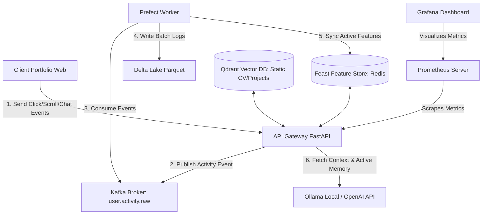

# Kế Hoạch Triển Khai: AI Portfolio Copilot & Real-Time Analytics

Dự án này biến một trang Portfolio tĩnh thông thường thành một **Hệ thống AI tương tác thời gian thực** có khả năng phân tích hành vi khách truy cập (HR/Nhà tuyển dụng), cá nhân hóa câu trả lời dựa trên ngữ cảnh đọc của họ, và hiển thị các số liệu Observability chuyên nghiệp thông qua Prometheus và Grafana.

---

## 🏗️ Sơ Đồ Kiến Trúc Hệ Thống (Architecture Flow)



---

## 📊 Định Nghĩa Dữ Liệu (Data Schemas)

### 1. Luồng Sự Kiện Thô (Kafka Topic: `user.activity.raw`)
Mỗi khi khách truy cập tương tác (Click dự án, cuộn trang, gõ chat), Frontend sẽ gửi JSON event:
```json
{
  "session_id": "hr-session-12345",
  "timestamp": "2026-05-18T15:45:00Z",
  "event_type": "page_scroll | project_click | chat_submit",
  "payload": {
    "target_section": "devops_skills",
    "project_name": "kubernetes-platform",
    "duration_ms": 12000,
    "user_query": "Does he know Kubernetes?"
  }
}
```

### 2. Feast Online Feature Store (Redis)
Lưu trữ trạng thái động của phiên truy cập hiện tại:
*   `visitor_session_id` (Entity)
*   `last_viewed_category`: Lĩnh vực dự án xem gần nhất (AI, DevOps, Web)
*   `engagement_score`: Điểm tương tác (dựa trên thời gian dừng đọc và click)
*   `chat_count`: Số câu hỏi đã đặt trong phiên

### 3. Qdrant Vector Collection (`portfolio_knowledge`)
Lưu trữ thông tin tĩnh phục vụ tìm kiếm ngữ cảnh (RAG):
*   `text_payload`: Chi tiết công việc cũ, mô tả dự án, thông tin liên hệ.
*   `metadata`: `category` (experience, education, project, faq).

---

## ⏱️ Bảng Lộ Trình Triển Khai Chi Tiết (Implementation Roadmap)

| Giai đoạn | Nhiệm vụ chính | Công nghệ sử dụng | Kết quả mong đợi |
| :--- | :--- | :--- | :--- |
| **P1: Thiết lập Hạ tầng Base** | Setup Docker Compose cho toàn bộ core-stack. | Docker, Kafka, Redis, Qdrant, Prometheus, Grafana | Toàn bộ 6 containers chạy mượt mà local. |
| **P2: Theo dõi hành vi (Tracking)** | Viết SDK Javascript nhỏ ở Frontend để bắt sự kiện click/scroll và đẩy về API Gateway `/api/v1/track`. | JavaScript, FastAPI, KafkaProducer | Events hành vi được gửi liên tục vào Kafka topic. |
| **P3: Data pipeline & Storage** | Xây dựng Prefect flow consume Kafka -> lưu Delta Lake -> đồng bộ Feast. | Python, Prefect 3.x, Feast, pandas | Dữ liệu hành vi được tổng hợp và ghi vào Redis sau mỗi 5s. |
| **P4: Cá nhân hóa Chatbot (RAG)** | Viết API Gateway tích hợp Qdrant (static) và Feast (dynamic) để gửi prompt tới LLM. | FastAPI, Qdrant Client, Ollama/OpenAI | Chatbot trả lời thông minh dựa trên cả CV tĩnh và dự án HR đang xem. |
| **P5: Dashboard đo lường** | Cấu hình Prometheus metrics và thiết kế Grafana Dashboard hiển thị lượng truy cập & tương tác. | Prometheus, Grafana | Dashboard sinh động hiển thị biểu đồ HR quan tâm chủ đề nào nhất. |

---

## 💻 Sample Code Cốt Lõi (Key Implementations)

### 1. Frontend Event Tracker (JavaScript)
Nhúng đoạn mã này vào Portfolio để theo dõi tương tác của HR thời gian thực:
```javascript
const SESSION_ID = "visitor_" + Math.random().toString(36).substring(2, 15);

function trackEvent(eventType, payload) {
    fetch('http://localhost:8000/api/v1/track', {
        method: 'POST',
        headers: { 'Content-Type': 'application/json' },
        body: JSON.stringify({
            session_id: SESSION_ID,
            event_type: eventType,
            payload: payload
        })
    }).catch(err => console.error("Tracking failed", err));
}

// Ví dụ: Theo dõi khi khách click xem dự án DevOps
document.getElementById('devops-project-btn').addEventListener('click', () => {
    trackEvent('project_click', { project_name: 'kubernetes-platform', category: 'DevOps' });
});
```

### 2. API Gateway: Cá nhân hóa Prompt dựa trên Feast (FastAPI)
Gateway kết hợp thông tin tĩnh từ **Qdrant** và thông tin tương tác động từ **Feast** để tạo ra câu trả lời đỉnh cao:
```python
from fastapi import FastAPI
from pydantic import BaseModel
import redis, requests

app = FastAPI()
redis_client = redis.Redis(host='localhost', port=6379, decode_responses=True)

class ChatRequest(BaseModel):
    session_id: str
    query: str

@app.post("/api/v1/chat")
async def chat_with_copilot(req: ChatRequest):
    # 1. Lấy thông tin tĩnh từ Qdrant (Ví dụ: CV tìm kiếm được)
    static_context = "DaVinci is a Platform Engineer with 3 years of experience in Kubernetes, Docker, and Kafka."
    
    # 2. Lấy thông tin động (hành vi vừa xem) từ Feature Store (Redis/Feast)
    last_viewed_category = redis_client.get(f"features:{req.session_id}:last_viewed_category") or "General"
    
    # 3. Chế biến Prompt thông minh (Cá nhân hóa theo ý định của HR)
    personalized_prompt = f"""
    Context: {static_context}
    The visitor is currently very interested in: {last_viewed_category} projects on your portfolio.
    
    User Query: {req.query}
    
    Instruction: Answer the query based on the context. If the visitor's focus is DevOps or AI, gently emphasize your relevant projects in that specific category to match their current viewing behavior.
    """
    
    # 4. Gửi tới LLM (Ollama hoặc OpenAI)
    # response = call_llm(personalized_prompt)
    return {"answer": f"Hi! Based on your interest in {last_viewed_category}, here is my answer...", "focus": last_viewed_category}
```

---

## 📈 Ý Tưởng Thiết Kế Grafana Dashboard (Observability)

Để làm nhà tuyển dụng "choáng ngợp", hãy dựng các Panels sau trên Grafana:
1.  **Metric: "Active HR Sessions" (Số phiên HR đang xem Portfolio):**
    *   *Query:* `count(count by (session_id) (http_requests_total{job="api-gateway"}))`
2.  **Metric: "Hot Topics Interest Split" (Biểu đồ tròn phân chia mức độ quan tâm):**
    *   *Mô tả:* Hiển thị tỷ lệ HR click xem kỹ năng AI vs. DevOps vs. Web.
3.  **Metric: "AI Copilot Response Latency" (Biểu đồ phân phối độ trễ suy diễn của LLM):**
    *   *Query:* `histogram_quantile(0.95, sum(rate(http_request_duration_seconds_bucket[5m])) by (le))`
