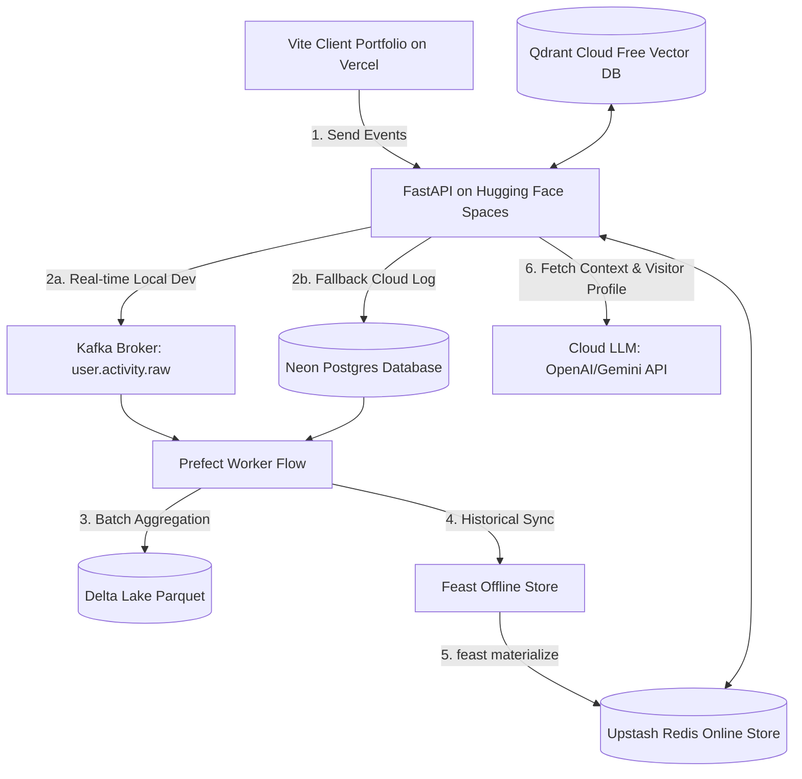

# Kế Hoạch Triển Khai: AI Portfolio Copilot & Real-Time Analytics

Dự án này nâng cấp trang Portfolio tĩnh của bạn thành một hệ thống thông minh, tương tác thời gian thực. Hệ thống này bao gồm:
1. **Dynamic Project Detail Pages:** Định tuyến (routing) phía Client động dựa trên cấu hình JSON/JS để dễ dàng cập nhật, thêm mới dự án mà không cần tạo file HTML mới.
2. **AI Copilot Floating Chat Widget:** Chatbot nổi ở góc màn hình kết nối với API Gateway (FastAPI) để cá nhân hóa câu trả lời dựa trên LLM API (OpenAI/Gemini) và hành vi của người dùng.
3. **Event Tracking & Hybrid Batch Pipeline (Phương án A - Free Deploy):** Cơ chế thu thập log tương tác gửi về API Gateway. Deploy API Gateway (FastAPI) chạy Docker 24/7 miễn phí trên **Hugging Face Spaces**, lưu trữ vector trên **Qdrant Cloud (Free)**, lưu Feast online features trên **Upstash Redis (Free)**, và lưu log tracking trên **Neon Postgres (Free)**.

---

## 🏗️ Sơ Đồ Kiến Trúc Hệ Thống (Architecture Flow - Phương án A)



---

## 📊 Định Nghĩa Dữ Liệu (Data Schemas)

### 1. Project Detail Data Structure (`portfolio-config.js`)
Mở rộng cấu trúc các dự án trong `portfolioConfig.projects` để chứa thông tin chi tiết:
```javascript
{
  id: "movie-ticket",
  title: "Movie Ticket Booking System",
  description: "Short description...",
  image: "assets/projects/movie-ticket.png",
  tags: ["Java", "Spring Boot", "PostgreSQL", "Flutter"],
  badge: "FULL-STACK",
  featured: true,
  codeLink: "https://github.com/...",
  // Phần thông tin chi tiết phục vụ trang chi tiết dự án:
  details: {
    longDescription: "Detailed breakdown of the architecture, databases, and client interactions...",
    architectureDiagram: "mermaid or image URL",
    challenges: [
      "Handling concurrent seat booking conflicts.",
      "Syncing Flutter local sqlite database with backend postgresql."
    ],
    solutions: [
      "Implemented PostgreSQL pessimistic locking for reservation transactions.",
      "Designed a custom synchronization queue with background workers."
    ],
    systemSpecs: {
      backend: "Spring Boot 3.x, Hibernate, PostgreSQL",
      frontend: "Flutter 3.x, Provider State Management",
      infrastructure: "Docker, GitHub Actions, AWS EC2"
    }
  }
}
```

### 2. Sự Kiện Theo Dõi (`user.activity.raw`)
```json
{
  "session_id": "visitor_xyz123",
  "timestamp": "2026-05-23T14:45:00Z",
  "event_type": "page_view | project_click | section_scroll | chat_query",
  "payload": {
    "target_id": "movie-ticket",
    "scroll_depth_percent": 75,
    "duration_ms": 15000,
    "user_query": "Dự án movie-ticket dùng DB gì?"
  }
}
```

---

## ⏱️ Giai Đoạn Triển Khai (Implementation Phases)

### Giai đoạn 1: Infrastructure & Docker Setup (Backend Base)
*   Thiết lập môi trường local với Docker Compose bao gồm các container: Redis (Feast Online), Qdrant, Prometheus, Grafana, Kafka/Zookeeper.
*   Thiết kế API Gateway (FastAPI) kết nối sẵn sàng với các dịch vụ này.

### Giai đoạn 2: Dynamic Project Pages (Frontend Routing)
*   Thực hiện client-side routing dựa trên URL Hash (ví dụ: `#/project/movie-ticket`) để render chi tiết dự án từ file JSON/JS cấu hình.
*   Thiết kế CSS layout đẹp mắt cho trang chi tiết (nút Back, danh mục, specs, challenges, solutions).

### Giai đoạn 3: Floating Chat Widget & LLM API Integration
*   Xây dựng giao diện Chatbot Widget nổi ở góc màn hình.
*   Cấu hình endpoint `/api/v1/chat` gọi Cloud LLM API (OpenAI/Gemini) sử dụng prompt nâng cao kết hợp ngữ cảnh tĩnh từ Qdrant RAG và hành vi động từ Redis (Feast).

### Giai đoạn 4: Tracking SDK & Fallback Storage (SQLite/Parquet)
*   Viết SDK JS để theo dõi hành vi và gửi event về `/api/v1/track`.
*   Tích hợp cơ chế SQLite Fallback lưu log tương tác khi deploy lên môi trường không có Kafka để dễ dàng thu thập dữ liệu thô.

### Giai đoạn 5: Data Pipeline, Feast Sync & Observability
*   Cấu hình Prefect Flow để định kỳ tổng hợp log tương tác thô và ghi vào Redis Online Store thông qua Feast (`feast materialize`).
*   Dựng Prometheus metrics ở FastAPI và thiết kế Grafana Dashboard hiển thị thống kê.

---

## 📋 Task Breakdown

### Phase 1: Infrastructure & Docker Setup (Status: COMPLETED)

#### TSK-001: Configure Core Infrastructure Container Stack [COMPLETED]
- **Agent:** `devops-engineer`
- **Skills:** `docker-expert`, `server-management`
- **Priority:** P0
- **Dependencies:** None
- **INPUT→OUTPUT→VERIFY:**
  - **Input:** Định nghĩa các cổng dịch vụ (Qdrant: 6333, Redis: 6379, Kafka: 9092, Prometheus: 9090, Grafana: 3000).
  - **Output:** File `docker-compose.yml` hoàn chỉnh trong thư mục gốc.
  - **Verify:** Chạy `docker compose up -d` và kiểm tra trạng thái các container bằng `docker compose ps` để đảm bảo tất cả đều ở trạng thái `running`.

#### TSK-002: Set Up Qdrant Collections for RAG [COMPLETED]
- **Agent:** `database-architect`
- **Skills:** `database-design`, `python-patterns`
- **Priority:** P1
- **Dependencies:** TSK-001
- **INPUT→OUTPUT→VERIFY:**
  - **Input:** Dữ liệu thông tin dự án và kinh nghiệm từ `portfolio-config.js`.
  - **Output:** Script Python `scripts/setup_qdrant.py` khởi tạo vector collection `portfolio_knowledge` và nạp dữ liệu static embeddings.
  - **Verify:** Chạy `python scripts/setup_qdrant.py` và truy cập Qdrant Web UI tại `http://localhost:6333/dashboard` để verify collection đã tồn tại và chứa dữ liệu.

---

### Phase 2: Dynamic Project Pages (Frontend Routing) (Status: COMPLETED)

#### TSK-003: Expand Portfolio Config with Detailed Project Metadata [COMPLETED]
- **Agent:** `frontend-specialist`
- **Skills:** `frontend-design`
- **Priority:** P0
- **Dependencies:** None
- **INPUT→OUTPUT→VERIFY:**
  - **Input:** Cấu trúc chi tiết mô tả dự án trong `src/data/portfolio-config.js`.
  - **Output:** Cập nhật file `src/data/portfolio-config.js` thêm trường `details` (longDescription, challenges, solutions, systemSpecs) cho `movie-ticket` và `attendance-app`.
  - **Verify:** Mở file `src/data/portfolio-config.js` để đảm bảo cấu trúc JSON hợp lệ và không lỗi cú pháp JS.

#### TSK-004: Implement Client-Side Hash Router in Frontend [COMPLETED]
- **Agent:** `frontend-specialist`
- **Skills:** `frontend-design`, `react-best-practices`
- **Priority:** P1
- **Dependencies:** TSK-003
- **INPUT→OUTPUT→VERIFY:**
  - **Input:** Lắng nghe sự kiện `hashchange` trong `src/main.js`.
  - **Output:** Code logic router trong `src/main.js` bắt các route dạng `#/project/:id`. Khi khớp, ẩn các section trang chủ (`#home`, `#journey`, `#projects`, `#skills`) và hiển thị container trang chi tiết `#project-details-view`. Khi quay lại `#` hoặc `#projects`, phục hồi giao diện cũ.
  - **Verify:** Thay đổi thủ công URL trình duyệt thành `http://localhost:5173/#/project/movie-ticket`, trang chủ phải ẩn đi và console hiển thị log nhận dạng đúng dự án `movie-ticket`.

#### TSK-005: Create and Render Project Detail Page Template [COMPLETED]
- **Agent:** `frontend-specialist`
- **Skills:** `frontend-design`, `tailwind-patterns`
- **Priority:** P1
- **Dependencies:** TSK-004
- **INPUT→OUTPUT→VERIFY:**
  - **Input:** Container `#project-details-view` trong `index.html` và dữ liệu từ `portfolio-config.js`.
  - **Output:** Render động các thông tin chi tiết dự án (Tiêu đề, ảnh, mô tả dài, danh sách thách thức/giải pháp dưới dạng thẻ, tech specs) bằng JS trong `src/main.js`. CSS được thiết kế chuyên nghiệp bằng Tailwind CSS v4.
  - **Verify:** Truy cập `http://localhost:5173/#/project/movie-ticket`. Đảm bảo trang hiển thị thông tin đầy đủ, có nút "Quay lại" hoạt động tốt, giao diện responsive mượt mà và không bị vỡ layout.

---

### Phase 3: Tracking SDK & API Fallback Logging (Status: COMPLETED)

#### TSK-006: Create FastAPI Tracking Endpoint with SQLite Fallback [COMPLETED]
- **Agent:** `backend-specialist`
- **Skills:** `api-patterns`, `nodejs-best-practices`
- **Priority:** P0
- **Dependencies:** TSK-001
- **INPUT→OUTPUT→VERIFY:**
  - **Input:** Endpoint `/api/v1/track` nhận JSON Event POST request.
  - **Output:** Code API Gateway FastAPI (`backend/main.py`) lưu sự kiện tương tác của người dùng. Nếu Kafka Broker khả dụng, push sự kiện vào Kafka. Nếu không (khi deploy cloud đơn giản), tự động ghi log sự kiện vào file local SQLite `/backend/data/tracking_events.db`.
  - **Verify:** Gửi HTTP POST request test đến `/api/v1/track` bằng `curl` hoặc Postman. Đảm bảo response trả về status `200 OK` và kiểm tra database SQLite có dòng dữ liệu mới.

#### TSK-007: Implement Javascript Tracking SDK on Client [COMPLETED]
- **Agent:** `frontend-specialist`
- **Skills:** `frontend-design`
- **Priority:** P1
- **Dependencies:** TSK-006
- **INPUT→OUTPUT→VERIFY:**
  - **Input:** Đoạn script tracking gửi HTTP POST request về `/api/v1/track`.
  - **Output:** Tích hợp SDK trong `src/main.js` tự động sinh `session_id` lưu ở `sessionStorage`. Gửi tracking event khi:
    - Click vào thẻ dự án (project card)
    - Cuộn trang quá 50% và 90% chiều dài trang
    - Gửi tin nhắn trên Chatbot
  - **Verify:** Tương tác với trang web trên browser, mở Network Tab trên Developer Tools để xác nhận các request POST gửi đến `/api/v1/track` thành công với payload chính xác.

---

### Phase 4: Hybrid Data Pipeline & Feast Feature Store (Status: COMPLETED)

#### TSK-008: Implement Prefect Flow for Batch Ingestion [COMPLETED]
- **Agent:** `backend-specialist`
- **Skills:** `api-patterns`
- **Priority:** P2
- **Dependencies:** TSK-006
- **INPUT→OUTPUT→VERIFY:**
  - **Input:** Log từ SQLite `/backend/data/tracking_events.db` hoặc Kafka raw topic.
  - **Output:** Prefect flow `backend/pipeline/ingestion_flow.py` chạy định kỳ (hoặc kích hoạt thủ công) để đọc dữ liệu thô, nhóm theo `session_id`, tính toán các chỉ số:
    - `last_viewed_category` (DevOps, Mobile, AI/ML)
    - `engagement_score` (tổng thời gian và số lượt tương tác)
    - `chat_count` (số tin nhắn đã gửi)
    Lưu kết quả dưới dạng Parquet.
  - **Verify:** Chạy script Prefect flow và xác nhận file parquet tổng hợp được tạo ra thành công tại `backend/data/processed/`.

#### TSK-009: Set Up Feast Feature Store Definitions and Materialization [COMPLETED]
- **Agent:** `database-architect`
- **Skills:** `database-design`
- **Priority:** P2
- **Dependencies:** TSK-008
- **INPUT→OUTPUT→VERIFY:**
  - **Input:** Schema Feast (Entity, Feature View) và file Parquet đầu ra của TSK-008.
  - **Output:** Thư mục cấu hình Feast `backend/feature_store/` với file `feature_store.yaml` sử dụng Redis làm online store. Script chạy `feast materialize` đồng bộ dữ liệu tổng hợp vào Redis.
  - **Verify:** Chạy lệnh `feast apply` và `feast materialize [TIMESTAMP]`. Chạy một test script Python để query online features từ Redis và xác nhận dữ liệu trả về khớp với tính toán.

---

### Phase 5: Floating Chatbot Widget & AI Agent (Status: COMPLETED)

#### TSK-010: Design Floating Chat Widget UI [COMPLETED]
- **Agent:** `frontend-specialist`
- **Skills:** `frontend-design`, `tailwind-patterns`
- **Priority:** P1
- **Dependencies:** None
- **INPUT→OUTPUT→VERIFY:**
  - **Input:** Khung giao diện HTML/CSS cho bong bóng Chat.
  - **Output:** Thêm thành phần Floating Chat Widget vào góc phải bên dưới của `index.html`. Widget có nút tròn biểu tượng chat, khi click sẽ mở ra khung chat có thể cuộn, ô nhập nội dung và nút gửi. Giao diện tối màu (dark mode) sleek, hiệu ứng bóng mờ (glassmorphism).
  - **Verify:** Truy cập website, click vào icon chat, khung chat mở lên mượt mà với micro-animation. Trông đẹp mắt và không che khuất các nút điều hướng quan trọng.

#### TSK-011: Implement API Gateway Personalized Chat Endpoint [COMPLETED]
- **Agent:** `backend-specialist`
- **Skills:** `api-patterns`, `vulnerability-scanner`
- **Priority:** P1
- **Dependencies:** TSK-002, TSK-009, TSK-010
- **INPUT→OUTPUT→VERIFY:**
  - **Input:** Endpoint `/api/v1/chat` nhận `session_id` và `query`.
  - **Output:** API FastAPI truy xuất context tĩnh từ Qdrant RAG, truy xuất online features từ Redis (để biết HR đang quan tâm chủ đề nào nhất qua Feast). Xây dựng Prompt cá nhân hóa và gọi Cloud LLM API (OpenAI/Gemini) sử dụng API Key cấu hình từ biến môi trường.
  - **Verify:** Gửi tin nhắn test từ chat widget trên giao diện (ví dụ: "Bạn đã làm dự án nào về di động chưa?"). Nhận về câu trả lời thông minh được tối ưu hóa dựa trên việc bạn vừa click xem dự án Flutter trước đó.

---

### Phase 6: Observability Stack (Prometheus & Grafana) (Status: COMPLETED)

#### TSK-012: Export Prometheus Metrics from API Gateway [COMPLETED]
- **Agent:** `devops-engineer`
- **Skills:** `server-management`
- **Priority:** P2
- **Dependencies:** TSK-011
- **INPUT→OUTPUT→VERIFY:**
  - **Input:** Prometheus client library tích hợp trong FastAPI.
  - **Output:** Endpoint `/metrics` trên API Gateway cung cấp số liệu: số lượng chat, độ trễ LLM API, và số phiên hoạt động.
  - **Verify:** Truy cập `http://localhost:8000/metrics` trên trình duyệt và thấy danh sách metrics dạng text chuẩn Prometheus.

#### TSK-013: Build Grafana Dashboard for Visitor Analytics [COMPLETED]
- **Agent:** `devops-engineer`
- **Skills:** `docker-expert`, `server-management`
- **Priority:** P2
- **Dependencies:** TSK-012
- **INPUT→OUTPUT→VERIFY:**
  - **Input:** File cấu hình Prometheus scraper trỏ tới API Gateway `/metrics`.
  - **Output:** File export JSON của Grafana Dashboard chứa panels: số session HR đang hoạt động, biểu đồ quan tâm chủ đề, và độ trễ LLM.
  - **Verify:** Mở Grafana tại `http://localhost:3000`, import dashboard và kiểm tra các biểu đồ tự động cập nhật số liệu khi ta click xung quanh trang Portfolio.

---

## 🏁 Phase X: Final Verification & Deployment Workflow

### 1. Quy Trình Cập Nhật Dữ Liệu Sau Khi Deploy (Deployment & Data Sync Workflow - Phương án A)
Để giải quyết yêu cầu: **"Deploy portfolio và track một thời gian, sau đó cập nhật dữ liệu"**, bạn thực hiện theo quy trình sau:
1. **Deploy Frontend & Gateway (Miễn phí vĩnh viễn):**
   - Deploy Frontend tĩnh lên **Vercel** hoặc **Netlify** (Free).
   - Đóng gói API Gateway (FastAPI) thành Docker Image và deploy lên **Hugging Face Spaces** (Free CPU, 16GB RAM, chạy 24/7 không ngủ đông).
   - Cấu hình API Gateway ghi log sự kiện thô trực tiếp vào **Neon Postgres** hoặc **Supabase Postgres** (Free Tier) thay vì chạy Kafka trên môi trường deploy.
2. **Thu Thập Log (Tracking Period):**
   - Khách truy cập (Nhà tuyển dụng) tương tác với trang web của bạn. Mọi hành vi scroll, click dự án, chat đều được ghi nhận trực tiếp vào Neon Postgres trên Cloud.
3. **Cập Nhật Dữ Liệu Offline (Batch Ingestion & Feast Sync):**
   - Định kỳ (ví dụ: mỗi tuần), bạn tải file database SQLite hoặc kết nối từ xa vào Neon Postgres để lấy log thô về máy local của mình.
   - Chạy Prefect Flow ở local để tổng hợp hành vi của người dùng thành các features (ví dụ: Điểm tương tác, danh mục xem nhiều nhất).
   - Chạy lệnh Feast Materialize để đồng bộ các features mới này vào Upstash Redis Online Store:
     ```bash
     cd backend/feature_store
     feast materialize-incremental $(date -u +%Y-%m-%dT%H:%M:%S)
     ```
   - Nếu bạn muốn cập nhật thông tin dự án mới trong Qdrant Vector DB: Cập nhật `portfolio-config.js` ở Frontend và chạy lại script nạp vector:
     ```bash
     python scripts/setup_qdrant.py
     ```

### 2. Các Script Kiểm Tra Tự Động (Mandatory Audit Checklist)
Trước khi bàn giao dự án hoàn tất, bạn phải chạy các script kiểm tra sau:

```bash
# 1. Chạy quét bảo mật các dependency và API key nhạy cảm
python .agent/skills/vulnerability-scanner/scripts/security_scan.py .

# 2. Kiểm tra tính tối ưu thiết kế UX/UI (Fitts Law, Contrast)
python .agent/skills/frontend-design/scripts/ux_audit.py .

# 3. Phân tích hiệu năng trang web qua Lighthouse (Yêu cầu đang chạy dev server)
python .agent/skills/performance-profiling/scripts/lighthouse_audit.py http://localhost:5173

# 4. Kiểm tra build Vite production của Frontend
npm run build
```

### 3. Rule Compliance Checklist
- [ ] Không sử dụng mã màu tím (Purple/Violet hex codes) ở giao diện.
- [ ] Các thành phần UI thiết kế hiện đại, tránh template mẫu nhàm chán.
- [ ] Mọi Task đều phải được xác thực thành công trước khi đánh dấu hoàn thành.

## ✅ PHASE X COMPLETE MARKER
- Lint: [ ] Pending
- Security: [ ] Pending
- Build: [ ] Pending
- Date: 2026-05-23
