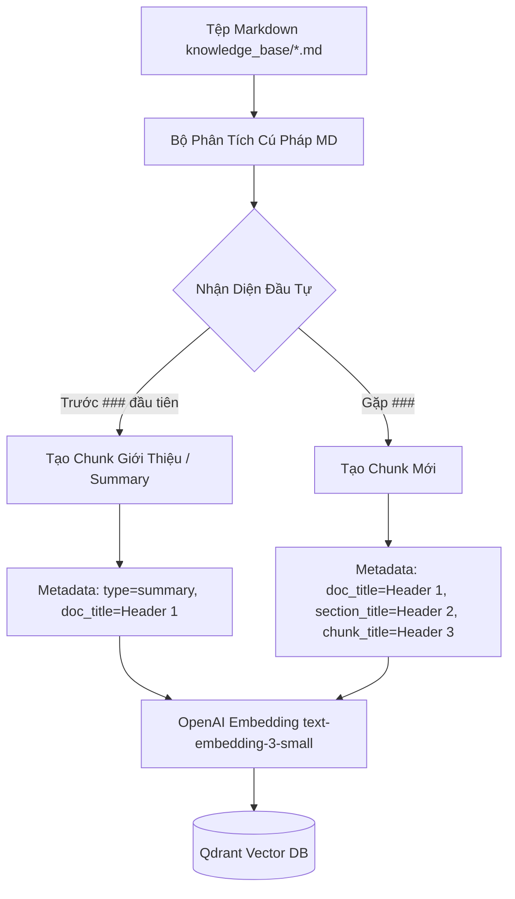

# Kế Hoạch Triển Khai: Phân Mảnh Theo Tiêu Đề (Heading-based Chunking)

Dự án này nâng cấp cơ chế phân mảnh (chunking) tài liệu tĩnh trong thư mục `knowledge_base/` của hệ thống AI Portfolio Copilot. Thay vì cắt văn bản đơn giản hoặc phân mảnh thô, hệ thống sẽ phân tích cú pháp Markdown để trích xuất cấu trúc phân cấp:
- `#` (Document Title): Đóng vai trò làm tiêu đề chính của tài liệu (lưu vào metadata).
- `##` (Section Title): Đóng vai trò làm nhóm phần lớn (lưu vào metadata).
- `###` (Chunk Title): Đóng vai trò đánh dấu ranh giới của một chunk văn bản cụ thể.
- Phần văn bản mở đầu trước `###` đầu tiên sẽ được tách ra thành chunk tóm tắt (`summary`).

---

## 🏗️ Thiết Kế Giải Pháp & Luồng Xử Lý (Architecture Flow)



---

## 🎯 Tiêu Chí Thành Công (Success Criteria)

1. **Phân tích cú pháp chính xác:** Tách đúng các block văn bản tương ứng với mỗi tiêu đề `###`.
2. **Metadata nhất quán:** Mỗi point được lưu lên Qdrant phải chứa:
   - `doc_title`: Lấy từ dòng `#` đầu tiên của file.
   - `section_title`: Lấy từ dòng `##` gần nhất trước đó.
   - `chunk_title`: Lấy từ dòng `###` của chính chunk đó.
   - `category`: `project_detail` hoặc `summary`.
3. **Chunk mở đầu độc lập:** Đoạn văn bản mô tả tổng quan (nếu có) trước thẻ `###` đầu tiên được lưu thành một chunk với metadata `section_title: "summary"`.
4. **Không lỗi dịch vụ:** Không làm gián đoạn API gateway hiện tại, giữ nguyên khả năng tìm kiếm ngữ cảnh.

---

## 🛠️ Công Nghệ Sử Dụng (Tech Stack)

- **Ngôn ngữ:** Python 3.x
- **Libraries:** `qdrant-client`, `openai`, `python-frontmatter` (hoặc regex parsing tiêu chuẩn để giữ thư viện gọn nhẹ).
- **Mẫu dữ liệu:** Markdown định dạng UTF-8.

---

## 📁 Cấu Trúc File Dự Kiến (File Structure)

```
my-portfolio/
├── knowledge_base/
│   ├── template.md           # Tệp mẫu hướng dẫn viết nội dung (Mới)
│   └── *.md                  # Các tài liệu dữ liệu (CV, Dự án) align theo template
├── scripts/
│   └── setup_qdrant.py       # Nâng cấp logic chunking theo tiêu đề (Chỉnh sửa)
└── docs/
    └── PLAN-heading-chunking.md  # Kế hoạch này (Mới)
```

---

## ⏱️ Chi Tiết Các Bước Triển Khai (Task Breakdown)

### Bước 1: Khởi Tạo Template Tài Liệu
* **Nhiệm vụ:** Tạo tệp mẫu `knowledge_base/template.md` định dạng chuẩn hóa cấu trúc để script parser xử lý chính xác.
* **Người thực hiện:** `documentation-writer` (Skill: `documentation-templates`)
* **INPUT:** Quy chuẩn cấu trúc heading (`#`, `##`, `###`).
* **OUTPUT:** Tệp `knowledge_base/template.md`.
* **VERIFY:** Mở file và kiểm tra cấu trúc có đủ 3 cấp tiêu đề và phần giải thích ví dụ không.

### Bước 2: Nâng Cấp Logic Cắt Tài Liệu Trong Script Setup
* **Nhiệm vụ:** Cập nhật hàm xử lý file markdown trong `scripts/setup_qdrant.py` để parse theo tiêu đề:
  - Dùng Regex hoặc Parser để lấy `#` làm `doc_title`.
  - Duyệt qua từng dòng để theo dõi `##` (`section_title`) hiện tại.
  - Khi gặp `###`, cắt nội dung từ đó tới `###` kế tiếp làm một chunk, lưu kèm `doc_title`, `section_title` và `chunk_title` tương ứng vào metadata.
  - Đoạn text trước `###` đầu tiên được lưu dưới dạng chunk `summary`.
* **Người thực hiện:** `backend-specialist` (Skill: `clean-code`)
* **INPUT:** Tệp `scripts/setup_qdrant.py` hiện tại.
* **OUTPUT:** Phiên bản mới của `scripts/setup_qdrant.py` có chứa thuật toán phân mảnh theo cấu trúc heading.
* **VERIFY:** Chạy thử nghiệm script ở chế độ debug/in ra màn hình để kiểm tra các chunk được cắt có đầy đủ metadata không.

### Bước 3: Đồng Bộ Hóa Dữ Liệu Lên Qdrant
* **Nhiệm vụ:** Chạy script `scripts/setup_qdrant.py` để tạo lại collection và đẩy toàn bộ dữ liệu mới lên Qdrant.
* **Người thực hiện:** `database-architect`
* **INPUT:** Các tệp dữ liệu đã align trong `knowledge_base/` và script mới.
* **OUTPUT:** Dữ liệu vector mới được lưu trong Qdrant collection `portfolio_knowledge`.
* **VERIFY:** Chạy script kiểm tra Qdrant để in số lượng point và định dạng metadata của các point xem có khớp với cấu trúc mới không.

---

## ✅ PHASE X: VERIFICATION CHECKLIST

- [ ] `knowledge_base/template.md` được tạo và hiển thị đúng định dạng Markdown.
- [ ] Chạy `scripts/setup_qdrant.py` không gặp lỗi cú pháp hay lỗi kết nối Qdrant/OpenAI.
- [ ] Xác nhận số lượng point trong collection Qdrant khớp/lớn hơn số lượng chunk được phân tích.
- [ ] Kiểm tra thực tế một vài point trong Qdrant có chứa đầy đủ metadata (`doc_title`, `section_title`, `chunk_title`).
- [ ] Chạy kiểm thử API Gateway `/api/v1/chat` để đảm bảo chatbot vẫn trả lời bình thường dựa trên dữ liệu mới.
